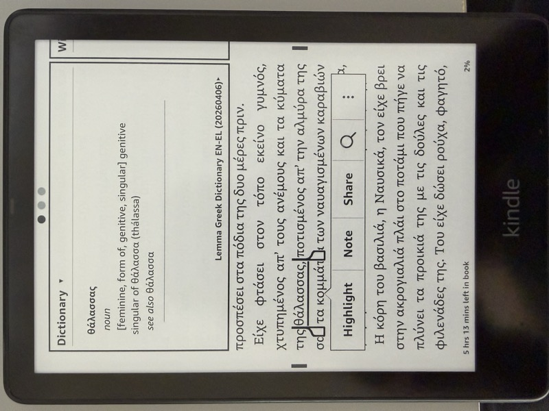
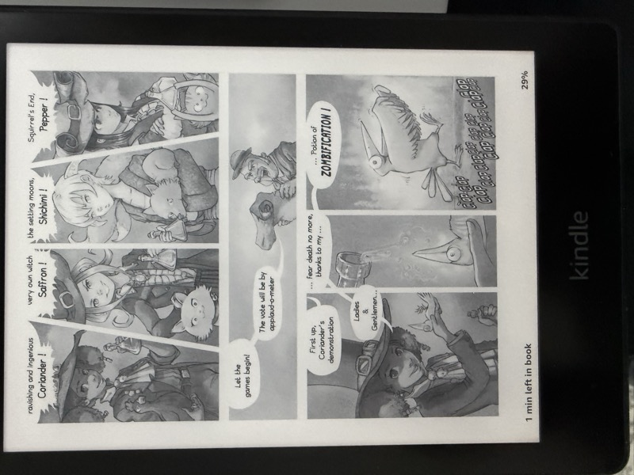

# Kindling


The missing Kindle toolkit. Dictionaries, books, and comics. Single static Rust binary, no dependencies, cross-platform.

Amazon deprecated *kindlegen* in 2020, leaving no supported way to build Kindle MOBIs. The only remaining copy is buried inside Kindle Previewer 3's GUI, can't run headless, and can take 12+ hours (or run out of memory entirely) for large dictionaries due to x86-only Rosetta 2 emulation on Apple Silicon, superlinear inflection index computation, and a 32-bit Windows build that crashes on large files. Kindling builds the same dictionary in 6 seconds.

For comics, [KCC](https://github.com/ciromattia/kcc) exists but requires Python, PySide6/Qt, Pillow, 7z, mozjpeg, psutil, pymupdf, and more. Installation is painful across platforms, there's no headless mode for CI, and Python image processing is slow. Kindling replaces all of that with a single statically-linked native binary, compiled from Rust.

Kindling was built by reverse-engineering Amazon's undocumented MOBI format byte by byte, with help from the [MobileRead wiki](https://wiki.mobileread.com/wiki/MOBI).

Pre-built binaries for Mac (Apple Silicon, Intel), Linux (x86_64), and Windows (x86_64): [Releases](https://github.com/ciscoriordan/kindling/releases)

<p align="center">
  
  
</p>

## Features

- **Dictionaries**: Full orth index with headword + inflection lookup, ORDT/SPL sort tables, fontsignature
- **Books**: EPUB or OPF input, embedded images, KF8 dual-format (KF7+KF8), HD image container, fixed-layout support
- **Comics**: Image folder or CBZ input, device-specific resizing, spread splitting, margin cropping, auto-contrast, manga RTL, webtoon support, Panel View markup
- Drop-in *kindlegen* replacement (same CLI flags, same status codes)
- Kindle Previewer compatible (EPUB source embedded by default)
- 75+ automated tests

## Installation

Download the latest release for your platform from [Releases](https://github.com/ciscoriordan/kindling/releases):

- **Mac Apple Silicon** - `kindling-mac-apple-silicon`
- **Mac Intel** - `kindling-mac-intel`
- **Linux** - `kindling-linux`
- **Windows** - `kindling-windows.exe`

Or build from source:
```bash
cd rust && cargo build --release
```

## Usage

### Dictionaries

```bash
kindling build input.opf -o output.mobi
kindling build input.opf -o output.mobi --no-compress    # skip compression for fast dev builds
kindling build input.opf -o output.mobi --headwords-only  # index headwords only (no inflections)
```

The input OPF must reference HTML files with `<idx:entry>`, `<idx:orth>`, and `<idx:iform>` markup following the [Amazon Kindle Publishing Guidelines](http://kindlegen.s3.amazonaws.com/AmazonKindlePublishingGuidelines.pdf). Both headwords and inflected forms are indexed so that looking up any form on the Kindle finds the correct dictionary entry.

### Books

```bash
kindling build input.epub -o output.mobi
kindling build input.epub                          # output next to input as input.mobi
kindling build input.epub --no-hd-images           # skip HD image container
kindling build input.epub --no-embed-source        # smaller file, but breaks Kindle Previewer
```

Auto-detects dictionary vs book by checking for `<idx:entry>` tags. Book MOBIs include embedded images, HD image container (for high-DPI Kindle screens), and KF8 dual-format output. The original EPUB is embedded by default for Kindle Previewer compatibility (`--no-embed-source` to skip).

### Comics

```bash
kindling comic input.cbz -o output.mobi --device paperwhite
kindling comic manga.cbz -o output.mobi --rtl              # manga (right-to-left)
kindling comic webtoon/ -o output.mobi --webtoon            # webtoon (vertical strip)
kindling comic input/ -o output.mobi --no-split --no-crop   # disable smart processing
```

Converts image folders and CBZ files to Kindle-optimized MOBI with:
- **Device profiles**: *paperwhite*, *oasis*, *scribe*, *basic*, *colorsoft*, *fire-hd-10*
- **Spread splitting**: Landscape images auto-split into two pages (disable: `--no-split`)
- **Margin cropping**: Uniform-color borders auto-removed (disable: `--no-crop`)
- **Auto-contrast**: Histogram stretching and gamma correction for e-ink (disable: `--no-enhance`)
- **Manga mode**: `--rtl` reverses page order and split direction
- **Webtoon mode**: `--webtoon` merges vertical strips and splits at panel gutters
- **Panel View**: Tap-to-zoom panel detection for Kindle (disable: `--no-panel-view`)
- **ComicInfo.xml**: Auto-reads metadata and manga direction from CBZ files

### Kindlegen compatibility

```bash
kindling input.epub                          # same as kindlegen
kindling input.epub -dont_append_source      # flag accepted
kindling input.epub -o output.mobi           # explicit output path
```

Drop-in replacement. Same CLI syntax, same status codes (`:I1036:` on success, `:E23026:` on failure).

## Performance and Comparisons

### vs kindlegen

| Input | *kindlegen* | kindling | Speedup |
|---|---|---|---|
| Greek dictionary (80K headwords, 452K entries) | 12+ hours, frequent OOM | 6 seconds | ~7,000x |
| Divine Comedy (138 illustrations, 29MB of images) | 19 seconds | 0.5 seconds | ~40x |
| Pepper & Carrot comic (20 images) | 1.4 seconds | 0.05 seconds | ~30x |

The ~7,000x dictionary speedup comes from skipping *kindlegen*'s complex inflection index computation (which scales superlinearly) and avoiding Rosetta 2 overhead on Apple Silicon. The gap is largest for heavily-inflected languages (Greek, Finnish, Turkish, Arabic) with hundreds of thousands of forms.

### vs KCC

| | KCC | kindling |
|---|---|---|
| Installation | Python + PySide6 + Pillow + 7z + mozjpeg + ... | Single binary, no dependencies |
| Binary size | ~200MB+ (with dependencies) | ~5MB |
| Image processing | Python/Pillow (multiprocessing with pickling overhead) | Rust/image + rayon (parallel, zero serialization) |
| Headless/CI | No (GUI-only, CLI is an afterthought) | CLI-first, scriptable |
| Apple Silicon | Rosetta for some dependencies | Native |
| Comic conversion (200 pages) | ~30 seconds | ~3 seconds |
| Kindle Scribe | 1920px height limit (kindlegen restriction) | Full 2480px native, no height limit |
| Image format | PNG/JPEG (PNG causes blank pages on Scribe) | JPEG only (safest for all Kindle devices) |
| Volume splitting | Buggy size estimation, premature splits | Always single file |
| Webtoon support | Yes | Yes |
| Panel View | Yes | Yes |
| Manga RTL | Yes | Yes |
| ComicInfo.xml | Yes | Yes |
| Kindle Previewer compat | No (separate step) | Built-in (EPUB embedded by default, `--no-embed-source` to save space) |

## How inflection lookup works

Kindling places all lookupable terms (headwords + inflections) directly into the orthographic index. Each inflected form entry points to the same text position as its headword:

| Orth index entry | Points to |
|---|---|
| cat | text position of "cat" entry |
| cats | text position of "cat" entry |
| cat's | text position of "cat" entry |
| θάλασσα | text position of "θάλασσα" entry |
| θάλασσας | text position of "θάλασσα" entry |
| θάλασσες | text position of "θάλασσα" entry |
| θαλασσών | text position of "θάλασσα" entry |

Looking up any form on the Kindle finds the correct dictionary entry.

*kindlegen* takes a different approach: a separate inflection INDX with compressed string transformation rules that map inflected forms back to headwords. This encoding is undocumented, limited to [255 inflections per entry](https://ebooks.stackexchange.com/questions/8461/kindlegen-dictionary-creation) (uint8 overflow), and adds complexity without benefit. Kindling has no per-entry limit.

## MOBI Format

Kindling works with the KF7/MOBI format used by Kindle e-readers. The key structures are:

- **PalmDB header**: Database name, record count, record offsets
- **Record 0**: PalmDOC header + MOBI header (264 bytes) + EXTH metadata + full name
- **Text records**: PalmDOC LZ77 compressed HTML with trailing bytes (`\x00\x81`)
- **INDX records**: Orthographic index with headword entries, character mapping, and sort tables
- **Image records**: Raw JPEG/PNG with JFIF header patching for Kindle cover compatibility
- **KF8 section**: Dual-format output with BOUNDARY record, KF8 text, FDST, skeleton/fragment/NCX indexes
- **HD container**: CONT/CRES records for high-DPI Kindle screens
- **FLIS/FCIS/EOF**: Required format records

### Key format details

Much of the foundational MOBI format knowledge comes from the [MobileRead wiki](https://wiki.mobileread.com/wiki/MOBI). The dictionary-specific details below were reverse-engineered from *kindlegen* output for this project.

- **Trailing bytes** (`\x00\x81`): The TBS byte MUST have bit 7 set for the Kindle's backward VWI parser to self-delimit. Using `\x01\x00` (wrong order, no bit 7) destroys all text content.
- **Inverted VWI**: Tag values use "high bit = stop" encoding (opposite of standard VWI).
- **EXTH 300** (fontsignature): LE USB/CSB bitfields + shifted codepoints. Tells firmware which Unicode ranges the dictionary covers.
- **EXTH 531/532**: Dictionary input/output language strings.
- **EXTH 547** (`InMemory`): Required for dictionary lookup activation.
- **SRCS record**: Must have 16-byte header (`SRCS` + length + size + count), pointed to by MOBI header offset 208. Required for Kindle Previewer.
- **MOBI header offset 112**: Must be `0x4850` for Kindle Previewer compatibility.
- **Dictionary links**: Anchor links work when browsing the dictionary as a book, but are disabled in the lookup popup. See the [Amazon Kindle Publishing Guidelines](http://kindlegen.s3.amazonaws.com/AmazonKindlePublishingGuidelines.pdf), section 15.6.1.

## Related projects

- [Lemma](https://github.com/ciscoriordan/lemma) - Greek-English Kindle dictionary built with kindling

## Star History

[](https://star-history.com/#ciscoriordan/kindling&Date)

## License

MIT - Copyright (c) 2026 Francisco Riordan
